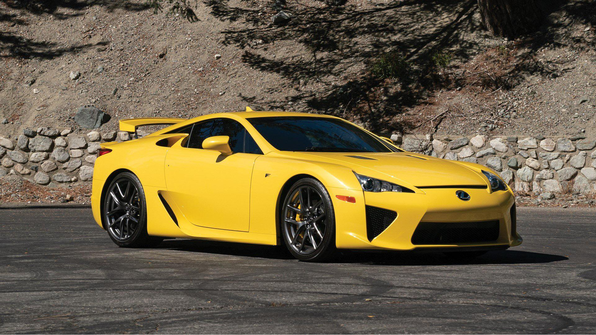
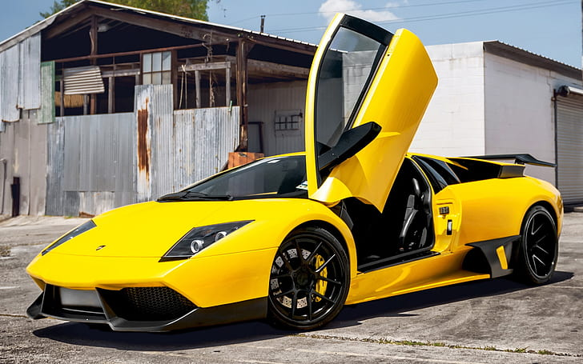

# dbcarrera (Cameron)

**`Entrepreneur/Developer/Learner`**

👋 Hello! I am a front-end developer with aspirations to one day be a unicorn 🦄. 

Not one of those rainbow dwelling creatures, but rather the founder of a private company worth over $1B 💸.

I don't really have much to say, so here are some pictures of cars 🚗🚗🚗:
|       |       |       |
| :---: | :---: | :---: |
|  |  |  |
|  |  |  |

<!--
**dbcarrera/dbcarrera** is a ✨ _special_ ✨ repository because its `README.md` (this file) appears on your GitHub profile.

Here are some ideas to get you started:

- 🔭 I’m currently working on ...
- 🌱 I’m currently learning ...
- 👯 I’m looking to collaborate on ...
- 🤔 I’m looking for help with ...
- 💬 Ask me about 
- 📫 How to reach me: Don't.
- 😄 Pronouns: He/him
- ⚡ Fun fact: I love Porsche
-->
